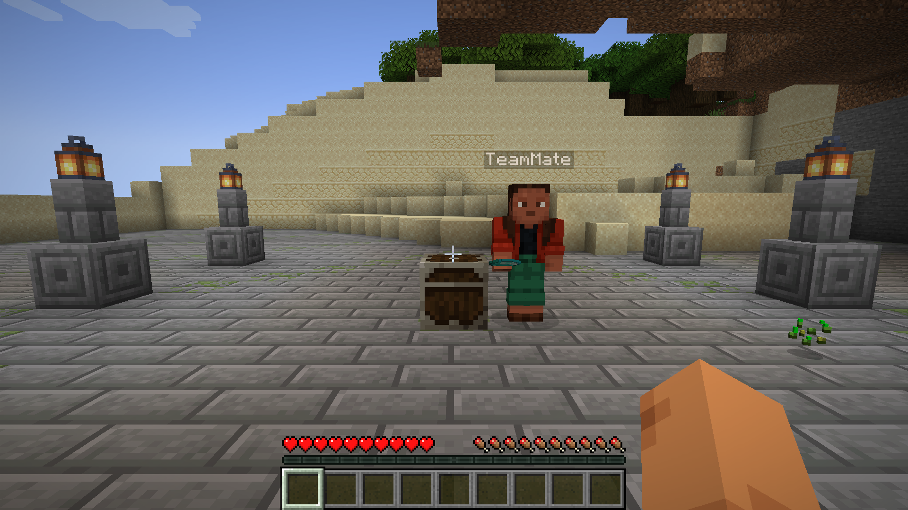
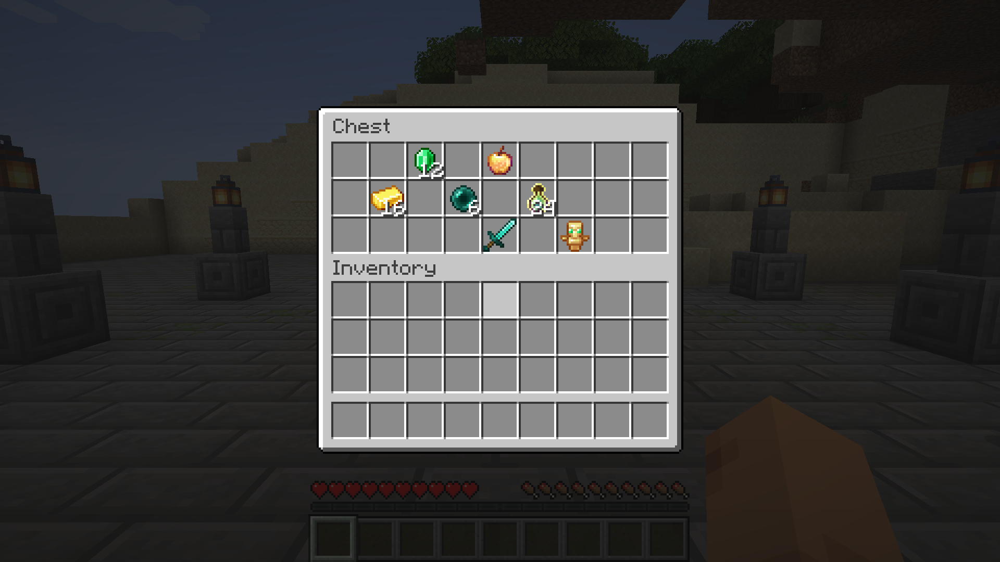

# Shared Lootr

<!-- PROJECT_PAGE_START -->

**One Lootr chest. One shared inventory for the whole team.**

Lootr normally gives each player a separate inventory when they open the same container. Shared Lootr changes that rule: every player now interacts with the same server-owned inventory for that Lootr container.


## What changes in game

- Everyone sees and takes items from the same container inventory.
- When one player removes an item, it is gone for everyone.
- The container's opened appearance and information overlays follow that shared state.
- Existing legacy per-player keys are left untouched but ignored; inventories are not merged or silently migrated.

This is intended for cooperative servers and modpacks that want Lootr containers to behave as team-shared loot instead of one reward per player.

## Requirements

Install the matching versions of:

- **Lootr**
- **RinLib**
- **Shared Lootr** for your Minecraft version and loader

Do not mix files built for different Minecraft versions or loaders. Use the dependency information attached to each download.

## Published compatibility

The current release covers **56 published Minecraft/loader combinations**, from Minecraft 1.12.2 Forge through the current Fabric and NeoForge lines. The Files tab is the source of truth for the exact file matching your instance.

Supported families include:

- Forge: 1.12.2, 1.16.5, 1.17.1, 1.18–1.20.1
- Fabric: 1.18 through current supported releases, including the listed snapshot build
- NeoForge: 1.20.4 through current supported releases

## Known upstream gaps

No Shared Lootr file is published for these combinations because the corresponding locked Lootr build fails before Shared Lootr can load:

- Minecraft 1.16.4 Forge
- Minecraft 1.19.3 Forge
- Minecraft 1.19.4 Forge
- Minecraft 1.20.2 Forge

These gaps are not presented as supported versions.

## Reporting a problem

When reporting an issue, include:

- Minecraft version
- Loader and loader version
- Shared Lootr, Lootr, and RinLib versions
- Whether the issue occurs with a newly placed Lootr container
- A minimal reproduction without unrelated mods when possible

Source and issue tracker: https://github.com/rinchan-hoshino/shared-lootr

## Screenshots

### One Lootr chest, one shared inventory



TeamMate has taken the four diamonds from the Lootr chest through the normal chest menu.



When TeamLead opens the same chest, the original diamond slot is empty while the other items remain. Both players resolve to the same shared inventory state.

<!-- PROJECT_PAGE_END -->

---

## Additional technical details

# Shared Lootr

Shared Lootr is a thin compatibility layer for Lootr. Lootr remains the sole owner of container conversion, block entities, menus, renderers, models, textures, particles, packets, and persistence; this project changes only inventory ownership from per-player to one shared inventory per container.

## Behavior

- Lootr converts supported generated chests, trapped chests, barrels, shulker boxes, minecarts, and tagged custom inventories through its native paths.
- Every player sees and modifies the same inventory for a given Lootr container.
- The existence of that shared inventory is the server-side source of truth for generated loot, the persistent opened appearance, and Jade's generated-loot state.
- Lootr's native block events and NBT carry that state to clients; Shared Lootr defines no packet or second server-side opened-state rule.
- Lootr's native conversion still turns each half of a vanilla double chest into a separate single Lootr chest.
- No vanilla container mixin, custom block entity, renderer, model, texture, particle, or packet is provided here.

## Incompatible upgrade

Shared Lootr 1.2.0 does not migrate per-player inventories created by Lootr or Shared Lootr 1.1.x. When 1.2.0 is installed in an existing world:

- Existing player-owned inventory entries remain stored but are not used.
- The first player to open each affected container creates a new shared inventory from its loot table.
- As a result, previously collected loot can become available again.

## Compatibility target

- Minecraft `1.21.1`
- NeoForge `21.1.248`
- Lootr `1.21.1-1.11.37.122`
- Java `21`

## Build

```bash
./gradlew :neoforge:build
```

The NeoForge artifact is written to `neoforge/build/libs/`.
